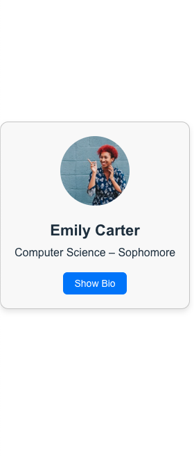

# Module 10A – StudentCard Code Review

## Description
This is a React code review assignment. I reviewed the StudentCard component and added comments to 
explain the logic behind props, state, and interactivity.

## What I Learned
- How to use and identify props and state
- How toggle functionality works with useState
- How to better document and explain React components

## Screenshot
